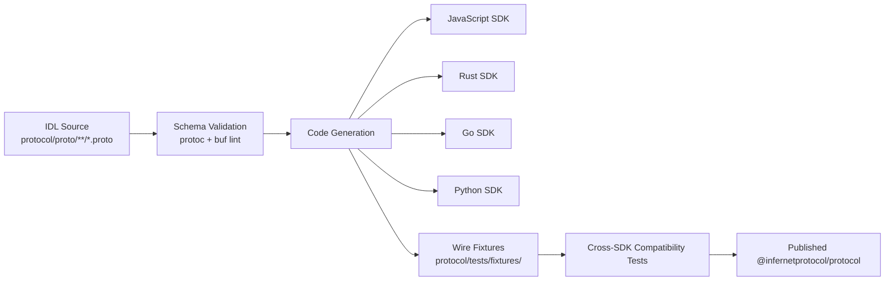
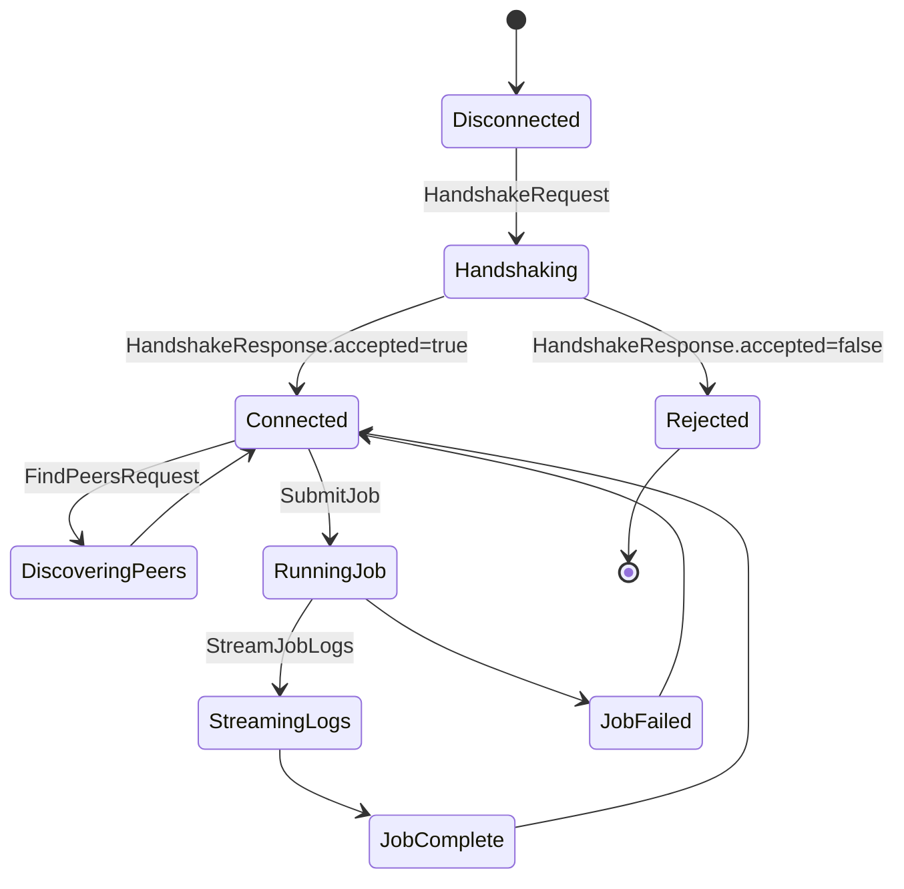
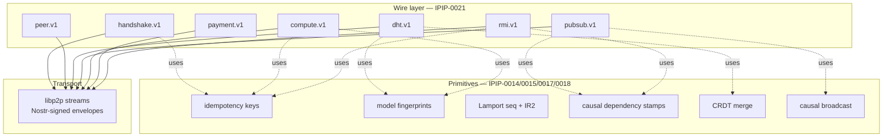
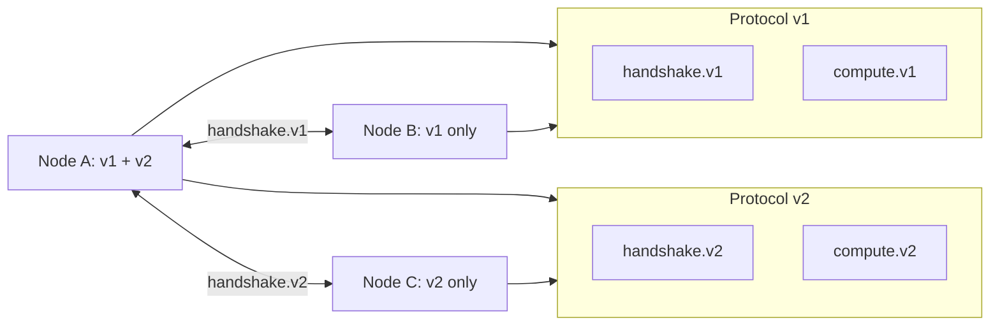

# Protocol architecture

The Infernet peer-to-peer protocol is defined as a set of versioned
Protocol Buffers packages under `protocol/proto/`. This document is
the entry point — read it first, then dive into the per-protocol
markdown for the wire details.

Spec: [IPIP-0021](../../ipips/ipip-0021.md).

## Packages at a glance

| Package | Purpose | Doc |
|---|---|---|
| `infernet.handshake.v1` | First contact: peer ID + version negotiation | [handshake.md](handshake.md) |
| `infernet.peer.v1`      | Find peers by namespace + protocol filter | [discovery.md](discovery.md) |
| `infernet.dht.v1`       | Kademlia key-value lookup | [dht.md](dht.md) |
| `infernet.pubsub.v1`    | Topic gossip with TTL + dedup | [pubsub.md](pubsub.md) |
| `infernet.compute.v1`   | Job submission + status streaming | [compute.md](compute.md) |
| `infernet.payment.v1`   | Payment-intent verification (verify-only) | [payment.md](payment.md) |
| `infernet.rmi.v1`       | Remote method invocation on stateful objects | [rmi.md](rmi.md) |

## End-to-end flow

## Connection lifecycle

## Layering against existing IPIPs

The proto packages sit on top of the distributed-systems primitives
already specified:

Every wire message is carried inside a Nostr-signed envelope
(IPIP-0003). Receivers verify the signature **before** decoding
the protobuf payload — a malformed payload should never reach
decode logic on the strength of an unverified envelope alone.

## Versioning

Protocol packages are versioned in their package name
(`infernet.<name>.v<n>`). Bumping the version is a breaking
change. Backwards-compatible additions go in the existing version
as new optional fields with new field numbers — old clients ignore
them, new clients see defaults when reading old messages.

The handshake step (per peer) negotiates the highest common
protocol version each side supports. No protocol stream opens
before this is done.

## Where to go next

- [handshake.md](handshake.md) — what happens on first connect
- [compatibility.md](compatibility.md) — version-bump rules
- [security.md](security.md) — envelope, replay, rate limits
- [rmi.md](rmi.md) — object-oriented invocation on top of the wire layer
