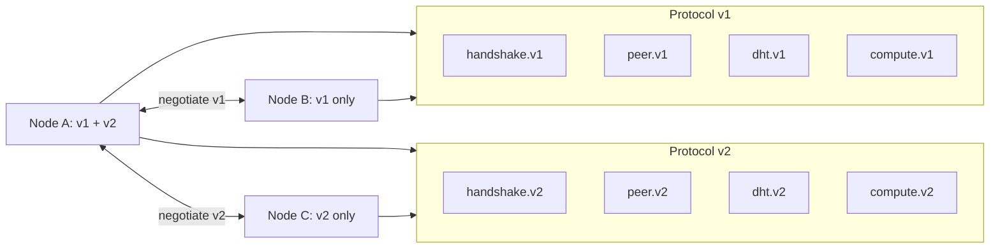
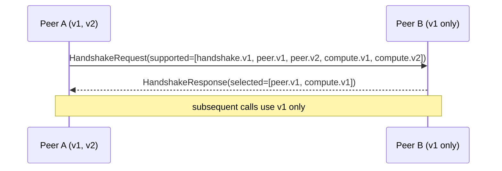

# Compatibility & versioning

The Infernet wire protocols evolve over time. This doc spells out
what changes are safe, what's a breaking change, and how peers
discover each other's version sets.

## Package versioning

Every protobuf package name embeds its version: `infernet.<name>.v<n>`.

## What's safe (additive)

- ✅ Adding a new optional field with a new field number
- ✅ Adding a new RPC method to a service (old clients ignore it)
- ✅ Adding a new error code (old clients fall through to a generic handler)
- ✅ Adding a new protocol package — show up in `supported_protocols`
  on next handshake; nodes that recognize it use it, others ignore

## What breaks (requires version bump)

- ❌ Removing a field or RPC method
- ❌ Changing a field's type or semantics
- ❌ Reusing a field number for a different field
- ❌ Renaming a wire-visible field, message, or service
- ❌ Adding a new *required* field (protobuf v3 has no `required`,
  but logically: any field that callers must populate is breaking
  to add)
- ❌ Tightening validation (e.g. shrinking the allowed range of an
  existing numeric field)

## Version negotiation

The handshake protocol carries `supported_protocols[]`. After
exchange, both sides take the intersection and use only those
versions on the connection. A peer offering disjoint versions gets
`accepted=false, reason="no overlapping protocol versions"` and
the connection drops.

## Deprecation window

When a package goes from `v1` to `v2`, both stay maintained for at
least **6 months**. After the window closes, `v1` may be removed in
a major release; nodes still on v1 are forced to upgrade to talk to
the network.

Removal is announced in the project's release notes and IPIP-0021's
amendment log at least 90 days in advance.

## Detecting breaking changes in CI

`infernet protocol diff <v1> <v2>` (planned for Milestone 5) checks
two snapshots of the proto files and reports breaking changes. CI
fails on PRs that introduce breakage in an existing version package
without bumping. To intentionally bump, the PR adds the new `v<n+1>`
package alongside the existing one.

## Cross-language ABI

The protobuf wire format is stable across languages. A message
encoded by the JS SDK decodes identically in Rust / Go / Python.
Wire-compatibility test fixtures in `protocol/tests/fixtures/`
verify this on every PR.
