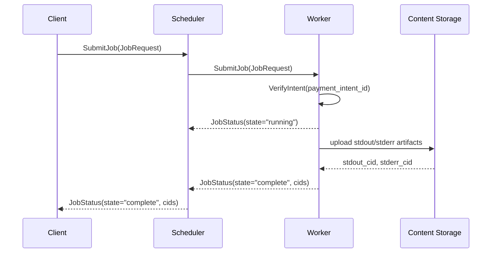

# `infernet.compute.v1`

Job submission to worker peers. Clients submit a `JobRequest` with a
`payment_intent_id`; workers verify the intent, run the job, stream
`JobStatus` updates back, and write output to content-addressed
storage.

IDL: [`protocol/proto/compute/v1/compute.proto`](../proto/compute/v1/compute.proto) ·
Spec: [IPIP-0010](../../ipips/ipip-0010.md) (workload classes) +
[IPIP-0014 §10](../../ipips/ipip-0014.md) (payment_intent_id as causal token).

## End-to-end flow



## State machine

```
queued → running → complete
   ↓        ↓
   canceled  failed
```

Workers MUST refuse to start a job until `VerifyIntent` returns
`valid=true` (per IPIP-0014 §10). Pre-state guards (IPIP-0014 §6)
prevent out-of-order state transitions.

## Errors

| Error | Worker behavior |
|---|---|
| `payment_intent_id` invalid / expired | refuse, return failed JobStatus |
| Resource requirements exceed offer | refuse, return failed JobStatus |
| Image pull failure | retry up to 3× with backoff, then failed |
| OOM during run | failed, exit_code from runtime |
| Network partition mid-run | hinted-handoff outbox per IPIP-0014 §9 |

## Security

- `JobRequest` envelope MUST be signed by the client's pubkey
- `payment_intent_id` MUST verify against the issuing control plane
  before any compute starts
- Output CIDs are content-addressed — clients verify the hash on
  download
- Workers SHOULD sandbox jobs (Docker / firecracker / equivalent)
  rather than run untrusted code on the host
