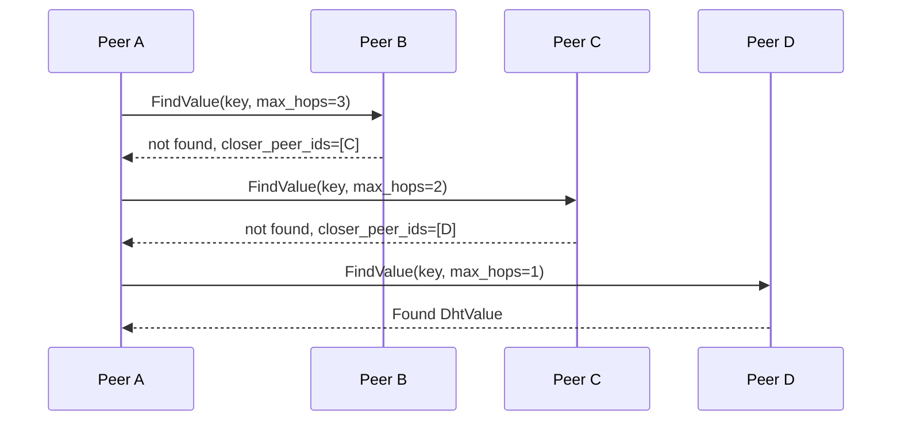

# `infernet.dht.v1`

Kademlia-style decentralized key-value lookup. Used to publish
provider announcements, model fingerprint records, and reputation
snapshots without a central registry.

IDL: [`protocol/proto/dht/v1/dht.proto`](../proto/dht/v1/dht.proto) ·
Spec: [IPIP-0016](../../ipips/ipip-0016.md) (DHT) +
[IPIP-0017](../../ipips/ipip-0017.md) (CRDT merge for partition heal).

## Lookup flow

## Record types

| Key prefix | Value | Convergence |
|---|---|---|
| `provider:` | provider announcement (multiaddrs, served_models, workload_classes) | LWW (single writer) |
| `model:`    | fingerprint → providers observed serving it | OR-Set CRDT (multi-writer) |
| `rmi:`      | RMI ObjectRef registry entry | LWW (owner-writer) |

The `convergence` field on each record drives partition-heal merge
behavior per IPIP-0017.

## Errors

- `max_hops == 0` and value not local → return `found=false` with
  the best `closer_peer_ids` we know
- Signature verification failure → discard the record + dock
  reputation of the publishing peer
- TTL expired (`expires_at_unix` < now) → treat as not-found, do
  not return as a stale value

## Security

- Every value MUST carry a Nostr/BIP-340 signature; receivers verify
  before storing or forwarding
- Per-publisher quota on records caps DHT spam (default: 100
  records / publisher / hour)
- Eclipse-attack mitigation: dial multiple bootstrap peers, refuse
  routing tables dominated by a single ASN
