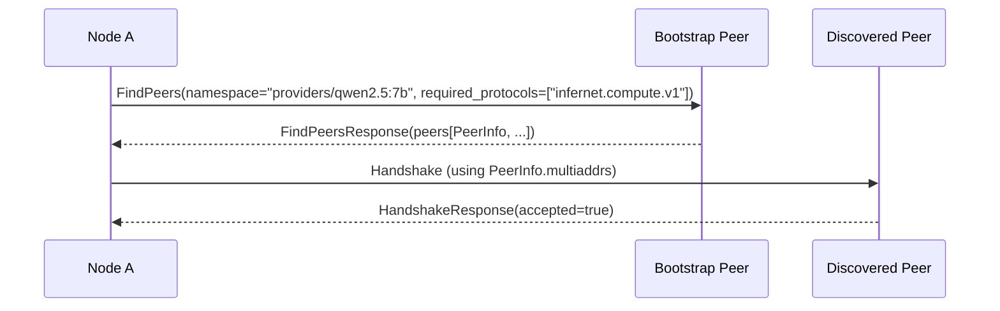

# `infernet.peer.v1`

Peer discovery — finding other peers by namespace + protocol filter.
Used after handshake to populate the local peer table or to find a
peer that can handle a specific job class.

IDL: [`protocol/proto/peer/v1/peer.proto`](../proto/peer/v1/peer.proto)

## Flow



## Example

Request:

```
namespace:           "providers/qwen2.5:7b"
required_protocols:  ["infernet.compute.v1"]
limit:               20
```

Response:

```
peers: [
    {
        peer_id:        "npub1aaa...",
        multiaddrs:     ["/ip4/203.0.113.10/tcp/4001/p2p/npub1aaa...", "/ip6/.../tcp/4001/p2p/npub1aaa..."],
        protocols:      ["infernet.handshake.v1", "infernet.peer.v1", "infernet.compute.v1"],
        last_seen_unix: 1777400000
    },
    ...
]
```

## Errors

The receiver returns an empty `peers` list rather than an error when
no matches exist; absence is the answer. Hard errors (auth, rate
limit) propagate through the transport, not the response body.

## Compatibility

- `namespace` is a free-form string. Convention: `<role>/<filter>`,
  e.g. `providers/qwen2.5:7b`, `validators/cpr`, `aggregators/eu-west`.
- Adding new namespaces is non-breaking; receivers that don't
  recognize a namespace return empty.
- Adding fields to `PeerInfo` follows the standard rules — new
  optional fields are safe; field-number reuse is forbidden.

## Security

- Receivers SHOULD rate-limit `FindPeers` per source peer (default:
  10 req/min) to prevent enumeration attacks.
- The list of peers returned MUST be filtered to those the
  receiver has *itself* successfully handshaked with — never
  forward unverified peer claims.
- A peer that consistently returns stale or malicious peer info
  loses reputation per IPIP-0007.
