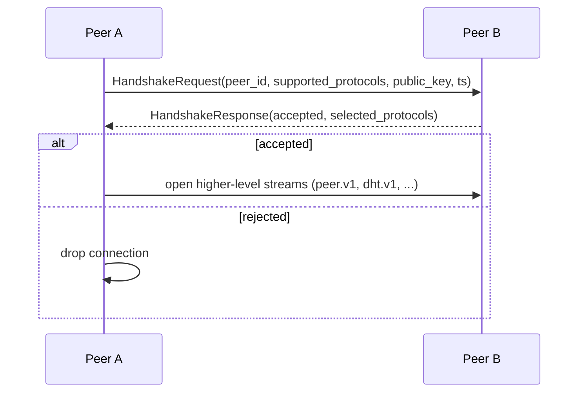

# `infernet.handshake.v1`

First-contact protocol. Two peers exchange `HandshakeRequest` /
`HandshakeResponse`, identify each other, advertise supported
protocol versions, and decide whether to keep the connection open.

IDL: [`protocol/proto/handshake/v1/handshake.proto`](../proto/handshake/v1/handshake.proto)

## Flow



## Example

Request:

```
peer_id:             "npub1abc..."
agent_version:       "infernet-cli/0.1.7"
supported_protocols: ["infernet.handshake.v1", "infernet.peer.v1", "infernet.dht.v1", "infernet.compute.v1"]
public_key:          <32 bytes>
timestamp_unix:      1777400123
```

Response (accepted):

```
peer_id:             "npub1xyz..."
accepted:            true
selected_protocols:  ["infernet.peer.v1", "infernet.dht.v1"]
reason:              ""
```

Response (rejected):

```
peer_id:             "npub1xyz..."
accepted:            false
selected_protocols:  []
reason:              "no overlapping protocol versions"
```

## Errors

| Cause | Receiver behavior |
|---|---|
| No overlapping `supported_protocols` | `accepted=false`, reason="no overlapping protocol versions" |
| `timestamp_unix` outside ±60s | `accepted=false`, reason="timestamp skew too large" (replay defense, IPIP-0014 §1) |
| Invalid `public_key` for `peer_id` | `accepted=false`, reason="public_key does not derive peer_id" |
| Peer is on the receiver's blocklist | `accepted=false`, reason="blocked" |
| Receiver is at connection limit | `accepted=false`, reason="capacity"; back off + retry |

## Compatibility

- v1 nodes MUST advertise every protocol they support, not just the
  one they want to use immediately.
- Adding a new protocol package (e.g. `infernet.training.v1`) does
  NOT bump handshake — it just shows up in `supported_protocols`.
- A breaking change to handshake itself (different field semantics)
  bumps to `handshake.v2`. v1 nodes and v2 nodes both attempt v1
  first for backward compat, then fall through to v2.

## Security

- Both peers verify the signing pubkey of the envelope matches
  `peer_id` before processing.
- The 60-second timestamp window defends against replay.
- Rate-limit incoming handshake attempts per source IP at libp2p's
  connection-manager layer to defend against amplification.
