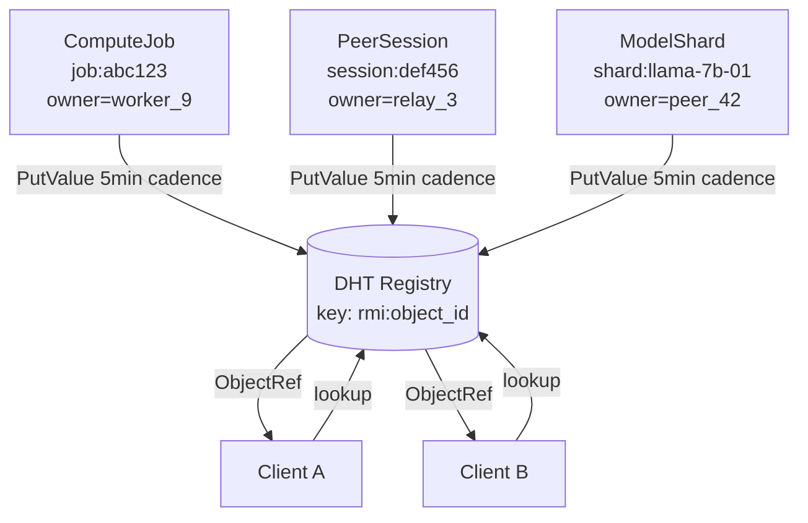
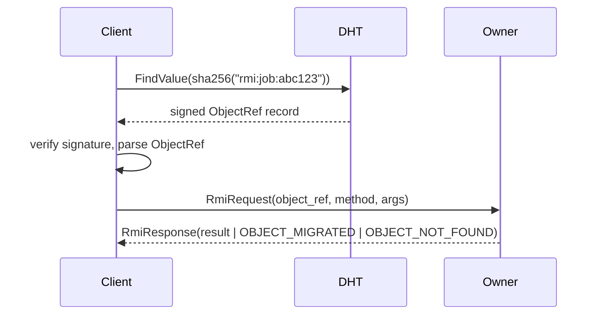

# Object registry

The registry maps `object_id → owner_peer_id` so RMI clients can
find where to send their method calls. v1 implementation is
DHT-backed (per IPIP-0016).

## Architecture



## Record format

Stored under DHT key `sha256("rmi:" + object_id)`:

```json
{
    "object_id": "job:abc123",
    "type_name": "infernet.compute.ComputeJob.v1",
    "owner_peer_id": "npub1worker9...",
    "multiaddrs": [
        "/ip4/203.0.113.10/tcp/4001/p2p/npub1worker9..."
    ],
    "methods": [
        "start", "pause", "resume", "cancel", "getStatus", "streamLogs"
    ],
    "expires_at_unix": 1777403600,
    "signature": "<BIP-340 over the canonical JSON above>"
}
```

The record is signed by the owner's pubkey; receivers verify
before trusting any field.

## Lookup → invoke



## Convergence policy

Per [IPIP-0017](../../ipips/ipip-0017.md), `rmi:` records use
**LWW-Register** convergence. Single-writer (the object's current
owner) — concurrent writes only happen during ownership
migrations and the loser of the LWW race is harmless because
the migration handshake (see [remote-object-lifecycle.md](remote-object-lifecycle.md))
provides redirect coverage.

## Method allowlist enforcement

The `methods[]` field in the registry record is **advertisement**,
not authorization. The server skeleton MUST also maintain its own
type-local allowlist and reject method invocations not in it. The
DHT advertisement helps clients discover what's available;
server-side enforcement prevents reflection-style exploits.

## Privacy

Registry records expose: the existence of an object, its type, its
owner's pubkey + multiaddrs. Operators who need privacy can avoid
the registry entirely (peer-to-peer ObjectRef passing without DHT
publication) — clients then need to know the ObjectRef out-of-band.
