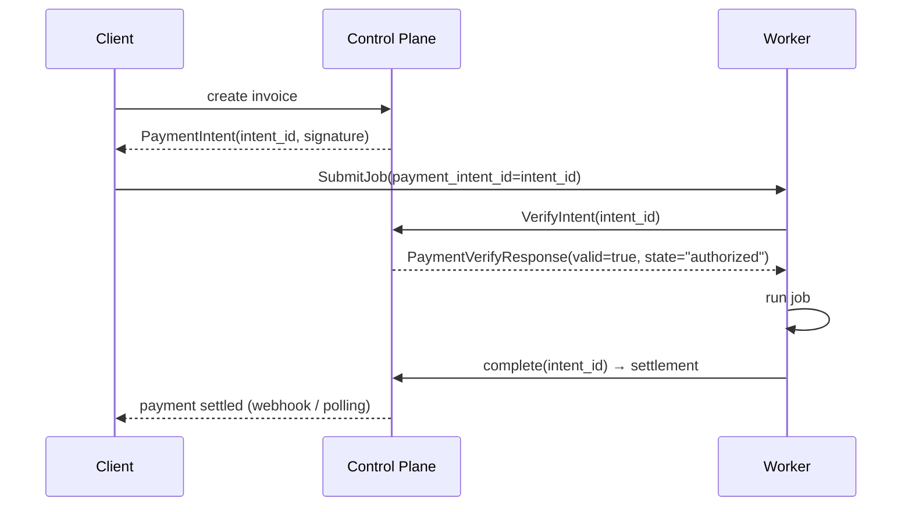

# `infernet.payment.v1`

Payment-intent verification. The actual payment ledger lives on the
centralized control plane (per IPIP-0014 §8: payments are strict CP,
never CRDT, never P2P-replicated). These messages just carry
references between peers — workers verify intent authorization
before running compute, and clients learn settlement state through
the same path.

IDL: [`protocol/proto/payment/v1/payment.proto`](../proto/payment/v1/payment.proto) ·
Spec: [IPIP-0014 §8 + §10](../../ipips/ipip-0014.md).

## Verify flow

## State

| State | Meaning |
|---|---|
| `pending`     | Intent created, payment not yet received |
| `authorized` | Funds escrowed, worker may start |
| `settled`    | Job complete, funds released to worker |
| `refunded`   | Job failed / not_implemented / canceled — funds returned |
| `expired`    | TTL passed without settlement |

## Errors

- `intent_id` unknown → `valid=false`, error="not found"
- Intent expired → `valid=false`, error="expired"
- Intent already settled → `valid=true`, state="settled" (idempotent verify)
- Control plane unreachable → worker MUST refuse to start; never
  optimistically run uncovered compute

## Security

- Workers MUST verify the control plane's signature on the
  `PaymentIntent` before accepting it
- `payment_intent_id` is the external causal token threading webhook
  + job-complete (IPIP-0014 §10) — the same intent_id links both
  sides of the transaction
- Replay defense: intents have explicit `expires_at_unix`; expired
  intents are rejected even if signature checks pass
