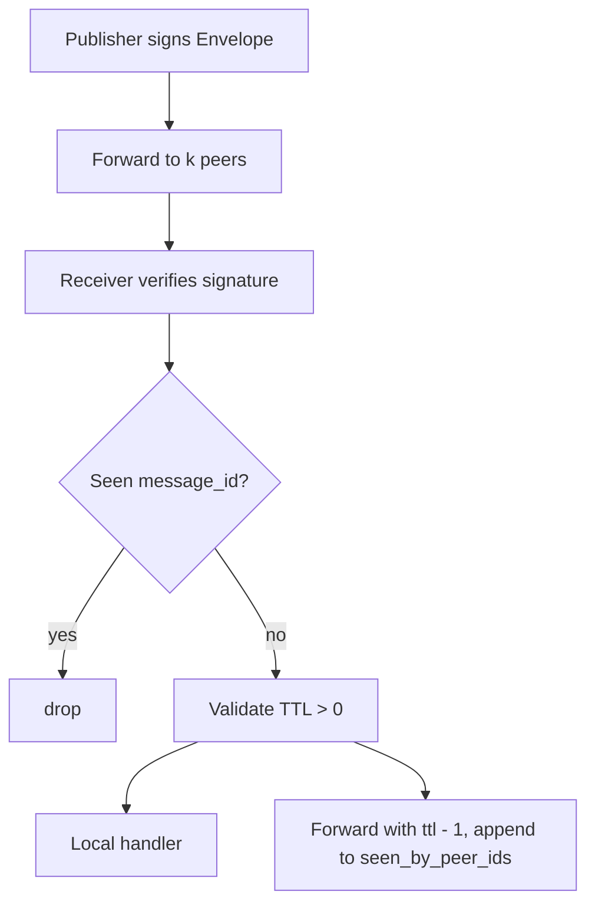

# `infernet.pubsub.v1`

Topic-based gossip. Publishers sign envelopes; receivers dedupe by
`message_id`, decrement TTL on each forward hop, and apply causal
delivery (per IPIP-0018) when ordering matters.

IDL: [`protocol/proto/pubsub/v1/pubsub.proto`](../proto/pubsub/v1/pubsub.proto) ·
Spec: [IPIP-0018](../../ipips/ipip-0018.md) (causal broadcast).

## Gossip flow

## Dedup + TTL

- `message_id` is unique per `(sender_peer_id, payload-hash)` —
  receivers that see the same id twice drop the duplicate
- `ttl` decrements per forwarder; at 0 the message is delivered
  locally but not forwarded
- `seen_by_peer_ids` accumulates the forwarder chain; a forwarder
  that's already in the list MUST drop (loop prevention)

## Causal delivery (when ordering matters)

For topics that need causal order (Class B.5 chain events,
Class C training step events), the Envelope payload carries
`parent_event_ids` per IPIP-0015 §1. Receivers buffer in a
holdback set until predecessors arrive (IPIP-0018 §3).

For topics where order doesn't matter (provider liveness pings,
model availability beacons), skip the holdback step and deliver
on arrival.

## Errors

- Bad signature → drop, log, dock publisher reputation
- TTL exceeds policy max (default 16) → drop, log
- Topic not subscribed → drop silently (not an error)
- Duplicate message_id → drop silently

## Security

- Replay defense: `timestamp_unix` outside ±60s → drop
- Per-publisher rate limit on messages-per-topic-per-second
- Topics with sensitive payloads SHOULD use payload encryption
  (out of scope for v1; receiver pubkey lookup via DHT)
