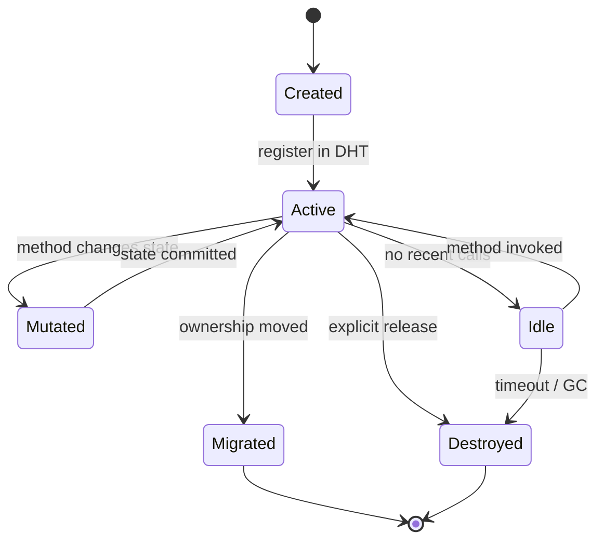
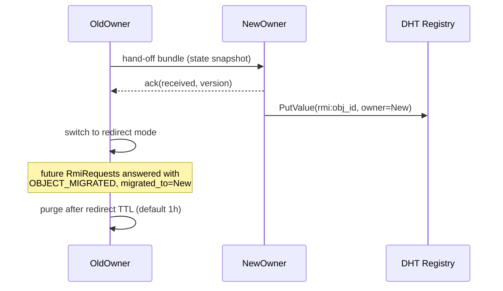

# Remote object lifecycle

## Phases

- **Created** — object instantiated locally; not yet visible to others
- **Active** — registered in the object registry (DHT entry under
  `rmi:<object_id>`); reachable via `RmiRequest`
- **Mutated** — handling a method that changes state; writes go
  through the state-transition guard from IPIP-0014 §6
- **Idle** — alive but no recent method calls; eligible for
  migration or GC depending on the type's policy
- **Migrated** — ownership transferred to another peer; old owner
  responds `OBJECT_MIGRATED` with the new ObjectRef
- **Destroyed** — record TTL expired or explicit release; future
  lookups return `OBJECT_NOT_FOUND`

## TTLs and republish

DHT registry entries (key: `rmi:<object_id>`) have an explicit
`expires_at_unix`. Owners republish every 5 minutes; an object
that stops republishing ages out within one TTL cycle (default:
1 hour). This is the AP guarantee per IPIP-0017 §3.

## Migration handshake

The redirect-mode period gives clients with stale ObjectRefs time
to discover the new owner without churning. After the redirect TTL,
the old owner forgets the object entirely.

## Garbage collection

Objects whose TTL expires without republish are deleted from the
local store. The DHT entry ages out independently. Clients
encountering an expired object see `OBJECT_NOT_FOUND` and can
optionally re-resolve via the registry to discover the new owner
(if the object was migrated rather than destroyed).
