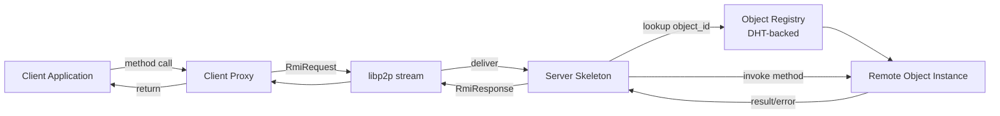
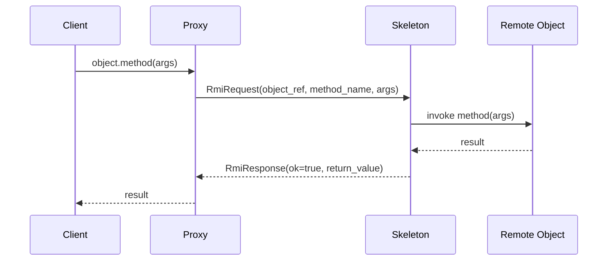
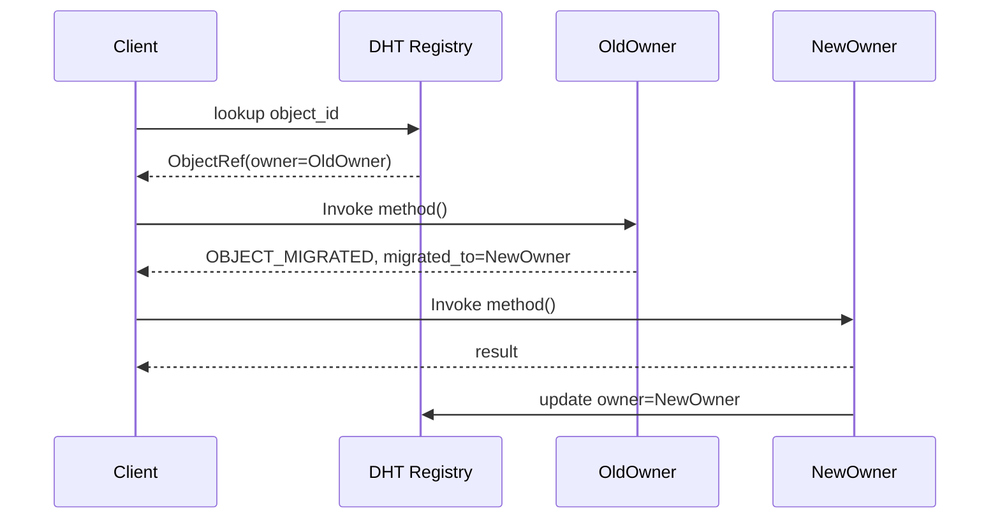
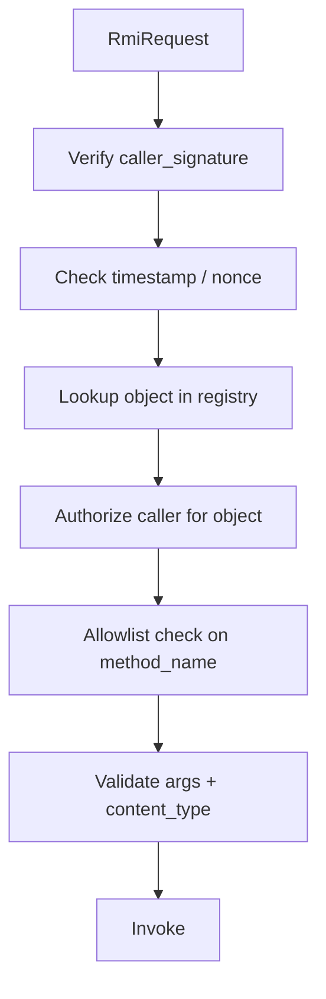

# `infernet.rmi.v1`

Remote Method Invocation — the object-oriented sibling of plain RPC.
Where RPC calls a free-standing function, RMI calls a method on a
specific object instance identified by an `ObjectRef`. The object
lives on a particular peer and carries state across calls.

IDL: [`protocol/proto/rmi/v1/rmi.proto`](../proto/rmi/v1/rmi.proto) ·
Related: [rpc-vs-rmi.md](rpc-vs-rmi.md) · [remote-object-lifecycle.md](remote-object-lifecycle.md) · [object-registry.md](object-registry.md).

## Architecture

## Basic invocation

## Object migration

Ownership can move between peers (rebalancing, peer churn). Old
owner returns `OBJECT_MIGRATED` with the new owner's `ObjectRef`;
the client retries against the new owner.

## Error codes

| Code | Meaning |
|---|---|
| `OBJECT_NOT_FOUND` | object_id doesn't exist or expired |
| `METHOD_NOT_FOUND` | object doesn't expose that method |
| `BAD_ARGUMENTS` | argument validation failed |
| `UNAUTHORIZED` | caller lacks permission |
| `STATE_CONFLICT` | method invalid for object's current state |
| `TIMEOUT` | invocation exceeded deadline |
| `OBJECT_MIGRATED` | object moved; see migrated_to |
| `INTERNAL_ERROR` | unhandled server-side error |

## Security

- Every request is Nostr-signed; receivers verify before decode
- `request_id` is the idempotency key (per IPIP-0014 §1) — same id
  + same body → cached response, never re-execute
- Method names use an allowlist per object type — no reflection on
  arbitrary attributes
- Per-peer + per-object + per-method rate limits

## Compatibility

Object types are versioned in their `type_name`, e.g.
`infernet.compute.ComputeJob.v1`. Bumping the type version is a
breaking change exactly like bumping a protobuf package. Clients
choose the type version they speak via the existing handshake-
negotiated protocol set.
